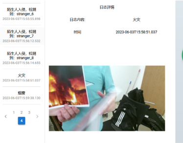

# BUAA-SE-2023

北航计算机学院 2023 春季学期嵌入式软工大作业项目

## 写在前面

北航计院软工有三个：罗杰软工、欧阳软工、嵌入式软工。根据学长学姐的说法是**这三个软工给分和压力的依次递减**，当时想摆于是选了嵌入式软工，体验很糟糕，以下是我个人的评价（可能带有一定的主观色彩）：

* 代码写的不多，文档和答辩非常多
* 有两个机器人，大家共用，可能存在很多问题
* 做个能交差的容易，做一个比较好的工作量还是很大
* ROS 相关的资料、例子比较少，尤其是 ROS 与外界进程交互方面，我们查阅了大量的资料，才找了个勉强能用的 ROSBridge，相关的库已经很久没有维护了，问题非常多
* 机器人抓取的包有问题，当时我们选的是带机械臂的机器人，有一个机械臂抓东西的 demo，但是完全抓不到，而且机械臂非常的不灵活，最后我们放弃了使用机械臂

## 整体架构

ROS 进程与前后端通过 ROSBridge 交互：具体来说机载电脑起 ROSBridge 在 9090 端口然后反向代理到一个公网服务器的 8000 端口，公网服务器上再开个 nginx 代理到 9090 端口（这个看上去没必要，但是去了我们跑不起来，不懂为啥），然后前后端通过该端口与 ROS 进程建立 WebSocket 链接。我们这样做的主要目的是为了让用户能够**在自己电脑上通过前端去查看机器人的状态并控制机器人（其他组基本上是需要在机载电脑上控制机器人，这显然不能用于实际生产环境**，这可能是我们组分高的一个原因吧）

## 部分功能展示

由于文档和答辩 PPT 设计组员个人信息，因此没有放到本仓库中，这里展示一些我们功能

### 前端标注航点

其他组标航点都是在机载电脑上操作的，我们认为没必要也不合理，手搓了一个能直接根据地图在前端标注航点的玩意儿

### 险情识别

支持火灾、烟雾检测报警（展示时用图片代替的），支持陌生人检测

### 远程控制

用户可以在前端实时看到机器人摄像头画面（间下图右上角，这个也是遥遥领先于其他组的，如果要用公网服务器做的话建议带宽在 5MB/s 以上），中间可以看到机器人建图情况和机器人位置方向（导航时还有航点位置方向），可以直接在前端点击或者按键盘控制移动

